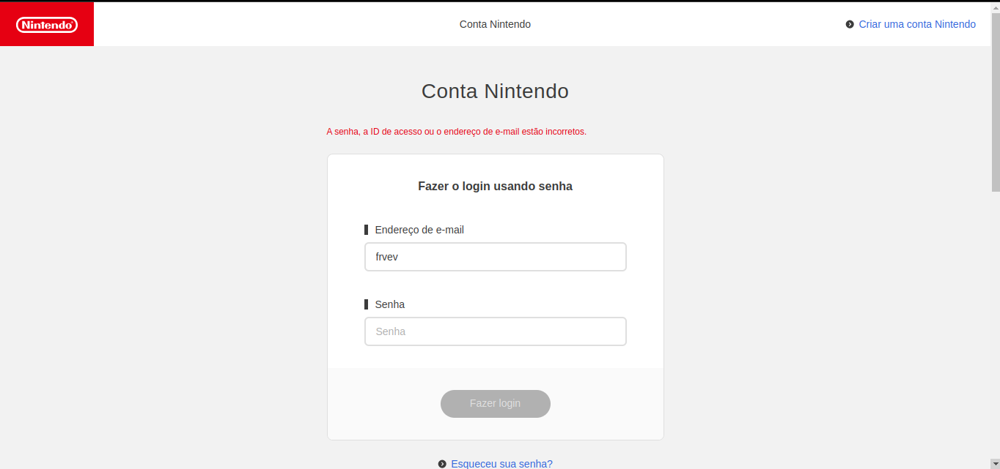
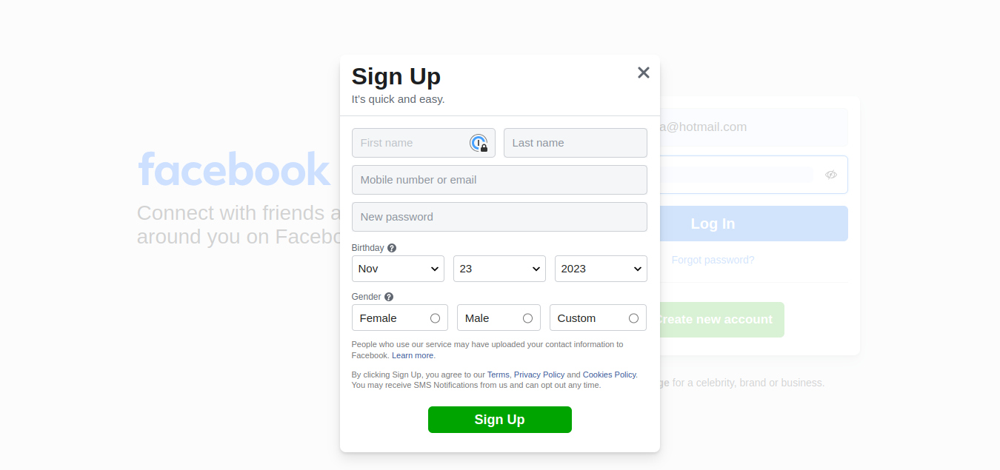
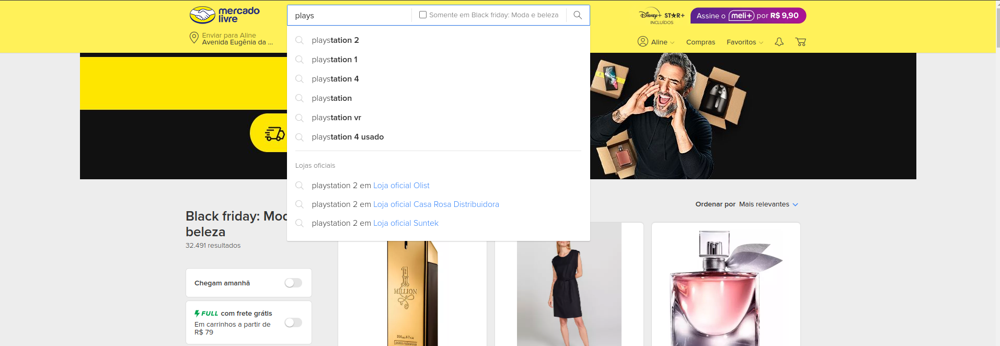
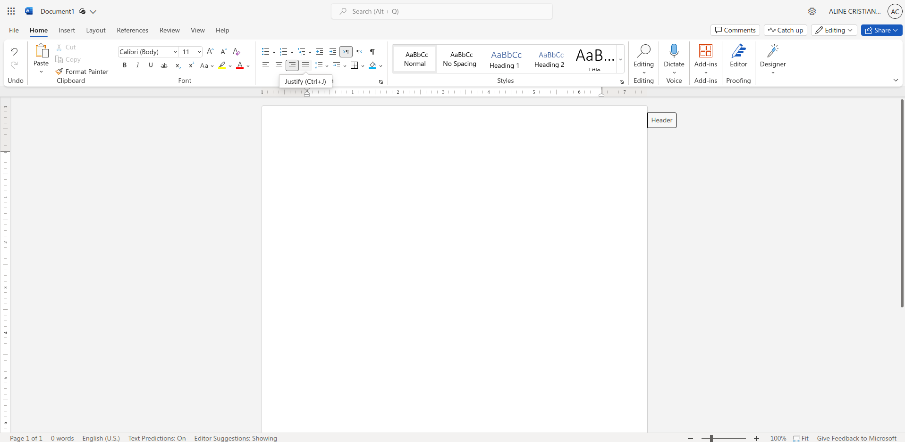
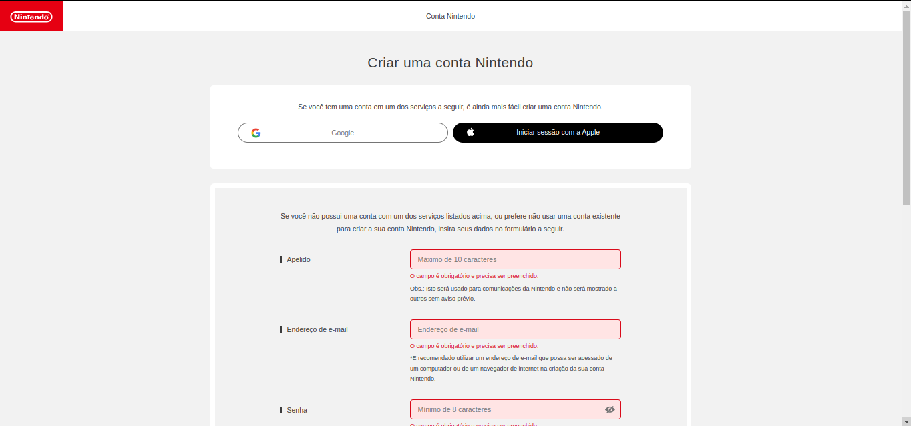
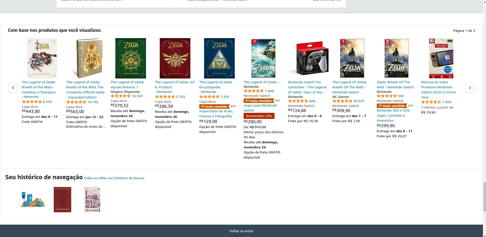
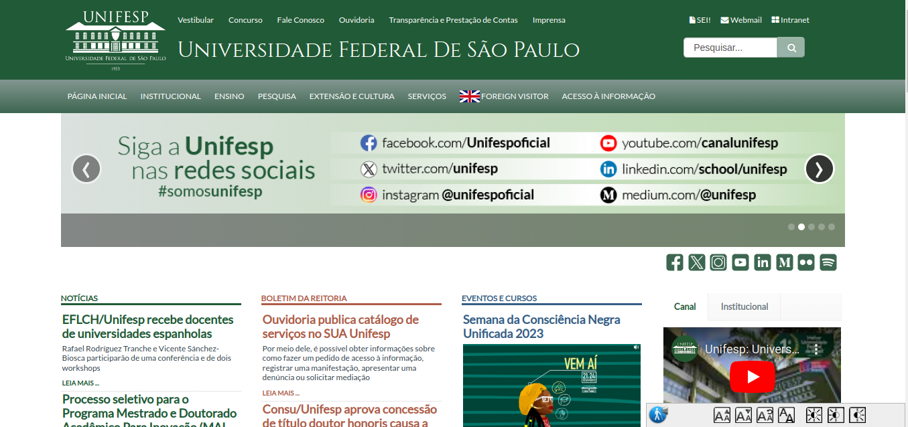
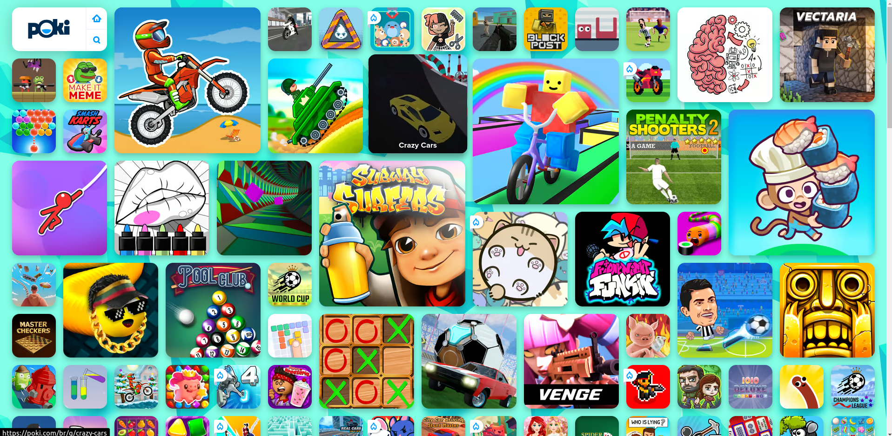
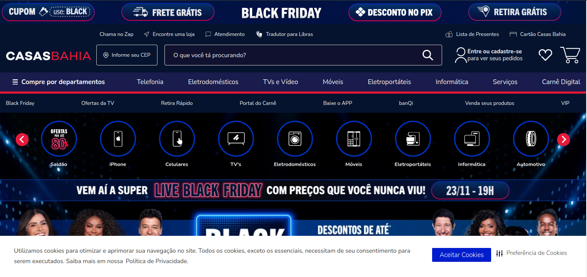
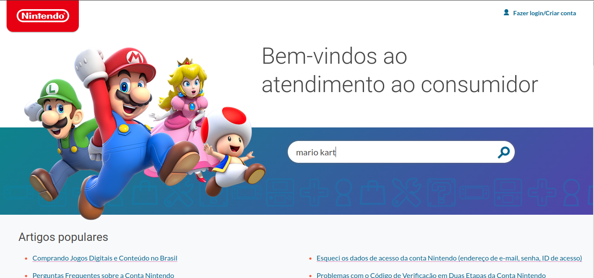

# Heurísticas

## :heavy_check_mark: Acerto
:eight_pointed_black_star: **Heurística nº 1: Visibilidade do status do sistema**

O sistema apresenta feedback ao usuário o mais rápido possível quando o Endereço de e-mail, ID de acesso ou Senha estão incorretos para efetuar o login.

## :heavy_check_mark: Acerto
:eight_pointed_black_star: **Heurística nº 3: Controle e liberdade do usuário**

É fácil para as pessoas desistirem de um processo ou desfazerem uma ação, como no exemplo da imagem é visível o símbolo X que permite cancelar a ação de criar uma nova conta de acesso ao site.

## :heavy_check_mark: Acerto
:eight_pointed_black_star: **Heurística nº 5: Prevenção de erros**

Ao pesquisar algum produto na barra de pesquisa do site, o mesmo oferece sugestões de produtos, assim evitando que o usuário erre na escrita do produto, ou gaste tempo procurando em produtos que não é de seu interesse mas que tem nome parecido com o que procura.

## :heavy_check_mark: Acerto
:eight_pointed_black_star: **Heurística nº 7: Flexibilidade e eficiência de uso**

Ao passar o mouse sobre alguma formatação de texto é mostrado as teclas de atalho para um uso mais eficiente da ferramenta.

## :heavy_check_mark: Acerto
:eight_pointed_black_star: **Heurística nº 9: Ajude os usuários a reconhecer, diagnosticar e se recuperar de erros**

O sistema usa recursos visuais tradicionais de mensagens de erro, como textos em vermelho, informando ao usuário o que deu errado em uma linguagem natural e sem jargões técnicos, oferecendo aos usuários uma solução, como uma mensagem do que deve ser corrigido.

## :heavy_check_mark: Acerto
:eight_pointed_black_star: **Heurística nº 6: Reconhecimento em vez de lembrança**

O site exibe o histórico de navegação dos produtos pesquisados. Ao fornecer acesso às páginas visitadas recentemente e pesquisas realizadas no passado, o site ajuda os usuários a retomar as tarefas que deixaram incompletas e que podem ter dificuldade em lembrar.

## :x: Erro
:eight_pointed_black_star: **Heurística nº 2: Correspondência entre o sistema e o mundo real**

O site não contém símbolos similares ao mundo real, os ícones utilizados não permite uma fácil identificação do que se quer dizer com aquele ícone, como por exemplo o ícone que no canto superior esquerdo da página, que contém um texto escrito "SEI!" ou o ícone com o texto "Intranet", sendo este texto difícil de entender seu significado.

## :x: Erro
:eight_pointed_black_star: **Heurística nº 4: Consistência e padrões**

Ao navegar no site é possível identificar uma falta de padrão nos formatos de cada jogo, não há menu de categorização, causando ao usuário uma confusão ou perda de tempo ao produrar por um jogo.

## :x: Erro
:eight_pointed_black_star: **Heurística nº 8: Design estético e minimalista**

O site contém muitas informações expostas, com cores muito parecidas, com elementos desnecessários distraindo os usuários das informações que eles realmente precisam, causando uma certa desorientação ao utilizar o sistema.

## :x: Erro
:eight_pointed_black_star: **Heurística nº 10: Ajuda e documentação**

O sistema não apresenta ajuda ao usuário conforme ele digita sua dúvida na barra de pesquisa da página de assistência, obrigando o usuário completar a pesquisa e ser direcionado para a página de resultados.

